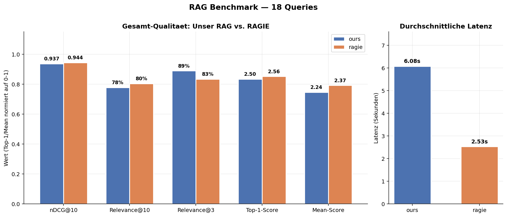
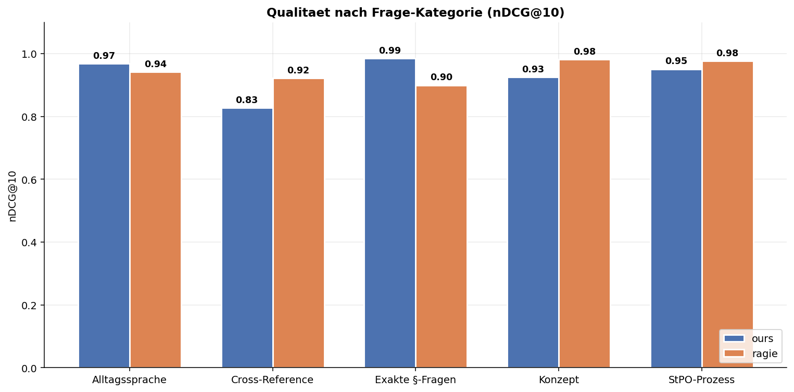
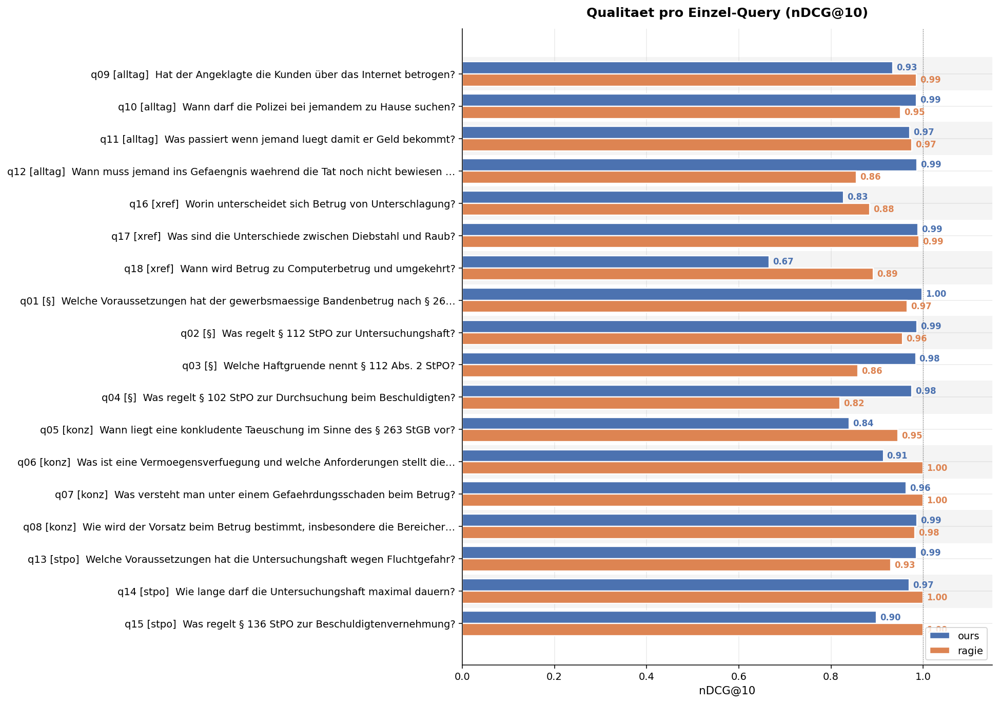
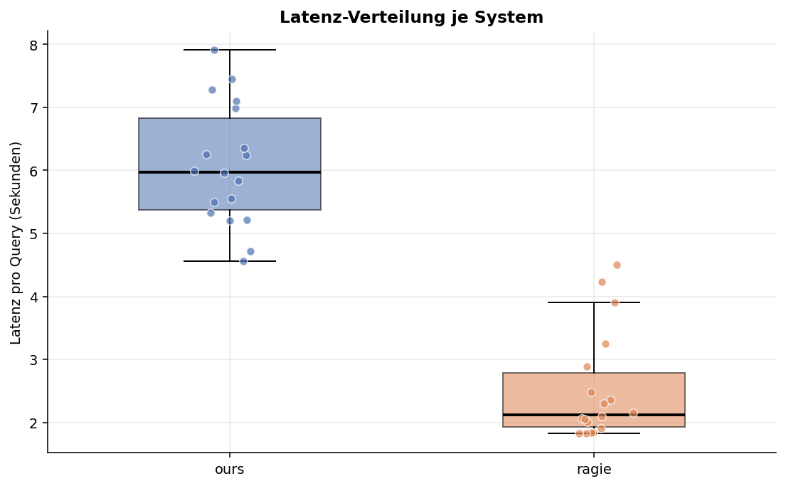
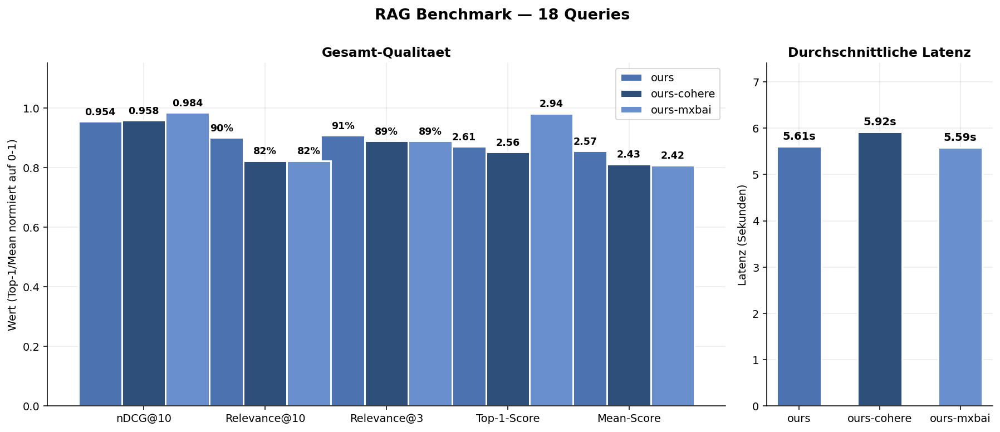
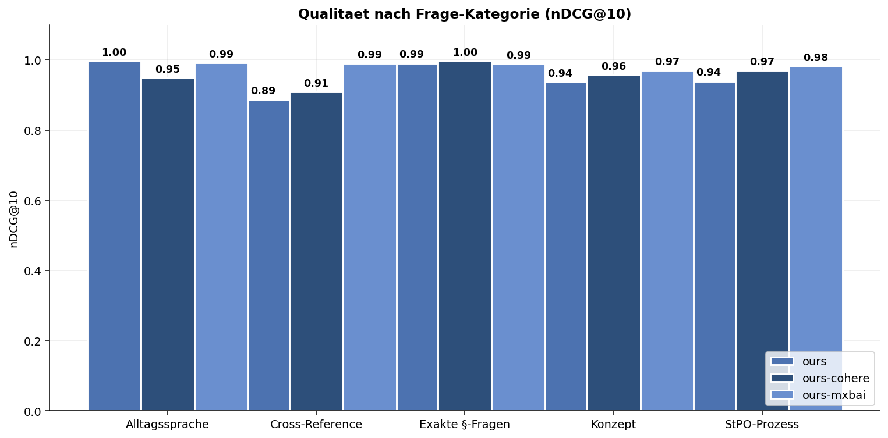
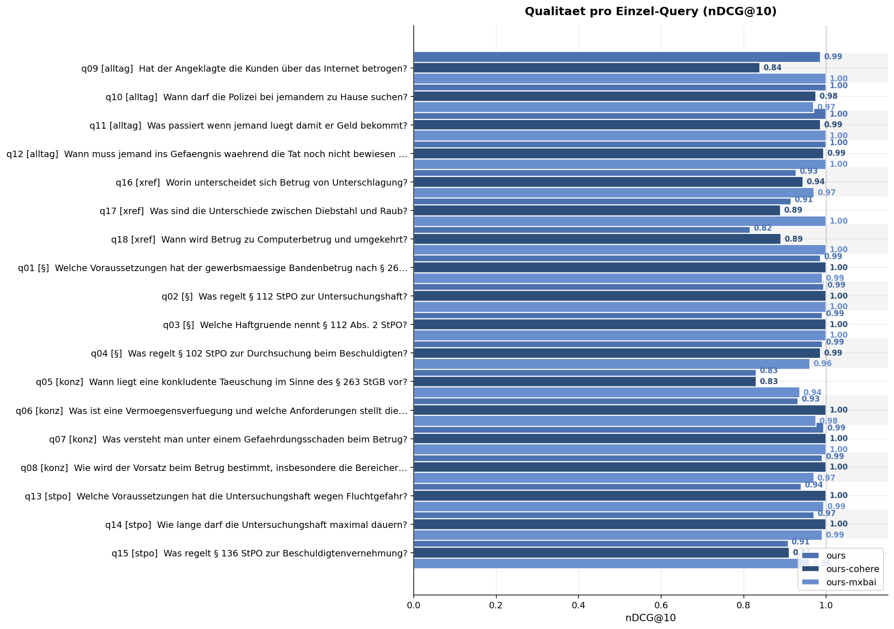
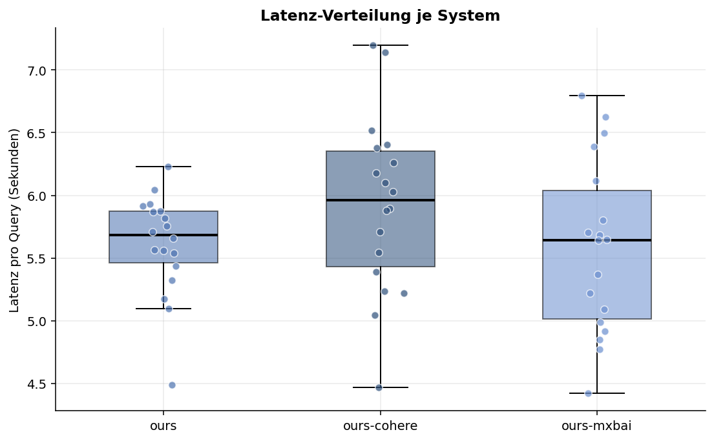

# Qdrant basiertes  RAG-System Benchmark und Optimierung speziell für Juristische Dokumente

Retrieval-Augmented Generation fuer **deutsche Strafrechtsliteratur** und **Ermittlungsakten**.

Verwandelt Alltagsfragen in praezise juristische Recherche — durchsucht Fischer StGB-Kommentar,
Schmitt/Koehler StPO-Kommentar und Ermittlungsakten mit einer dreistufigen Pipeline:

```
Nutzerfrage
  "Hat der Angeklagte die Kunden ueber das Internet betrogen?"

    |  Query Expansion (Claude)
    v
  "Internetbetrug, Taeuschung ueber Tatsachen mittels digitaler
   Kommunikation, Vermoegensverfuegung, § 263 Abs. 1 StGB"

    |  Hybrid Search (Dense + BM25)
    v
  40 Kandidaten aus Kommentaren + Ermittlungsakten

    |  Cross-Encoder Reranking (Cohere)
    v
  Top 5 Treffer, nach juristischer Relevanz sortiert
```

---

## Features

- **Paragraph-aware Chunking** — erkennt §§, Randnummern und Gliederungsebenen in
  Kommentarliteratur; Breadcrumb-Kontext in jedem Chunk (`[§ 263 StGB – B. Obj. Tatbestand – Rn. 78]`)
- **Dokumenttyp-Klassifikation** — ordnet Ermittlungsakten automatisch zu
  (Anklageschrift, Vermerk, Zeugenaussage, Beschluss, ...)
- **Gewichtete Hybrid-Suche** — Dense Embeddings (`multilingual-e5-large`) + BM25 Sparse Vectors
  mit quellenabhaengiger Gewichtung (Kommentare: BM25 staerker / Akten: Dense staerker)
- **Query Expansion** — Claude reformuliert Alltagssprache in juristische Fachterminologie
  und extrahiert automatisch relevante §§ als Metadata-Filter
- **Cross-Encoder Reranking** — Cohere `rerank-v3.5` (oder lokaler Fallback mit
  `BAAI/bge-reranker-v2-m3`) sortiert Kandidaten nach inhaltlicher Relevanz
- **Getrennte Collections** — `fachliteratur` (persistente Kommentare) und
  `ermittlungsakten` (fallbezogen), einzeln oder kombiniert durchsuchbar
- **Metadata-Filter** — `--paragraph`, `--gesetz`, `--fall`, `--aktenzeichen`, `--dokument-typ`
- **Interaktiver Modus** — REPL mit Live-Filtern, Toggle fuer Expansion/Reranking
- **Benchmark-Suite** — vergleicht Retrieval-Qualitaet mit anderen RAG-Systemen per
  LLM-as-Judge (Claude), inkl. automatischer Chart-Generierung

---

## Benchmark: Unser RAG vs. RAGIE vs. OpenAI vs. Vectara

Der Benchmark vergleicht die Retrieval-Qualitaet unseres Systems gegen drei externe RAG-Dienste
auf **18 juristischen Test-Queries** aus 5 Kategorien (exakte §-Fragen, Konzepte, Alltagssprache,
StPO-Prozessrecht, Cross-Reference). Alle vier Systeme werden mit **identischen Fachliteratur-Daten**
(Fischer StGB + Schmitt/Koehler StPO) befuellt, die Relevanz jedes Top-K Chunks bewertet
**Claude** auf einer Skala 0-3.

> Gemini File Search wurde nachgereicht (siehe [Nachzuegler: Gemini File Search](#nachzuegler-gemini-file-search))
> nachdem der Google-Upload-Endpoint wieder stabil war und ein Adapter-Bug
> behoben wurde.

| System | Technologie |
|---|---|
| **ours** | Qdrant + E5-Large + BM25 + Claude-Expansion + Cohere-Reranking |
| **ragie** | Managed RAG Service (hybrid + integriertes Reranking) |
| **openai** | OpenAI Vector Stores API (Dense-only) |
| **vectara** | Vectara Managed RAG (Boomerang-2 multilingual Embeddings) |
| **gemini** | Gemini File Search Store (separat nachgereicht) |

### Gesamtergebnis



**Unser RAG fuehrt bei der Qualitaet knapp vor RAGIE** — nDCG@10 **0,972** (RAGIE 0,964, Vectara 0,940, OpenAI 0,735),
bei **Relevance@3** sind **91 %** der Top-3-Treffer tatsaechlich relevant (RAGIE 83 %, Vectara 54 %, OpenAI 44 %).
**Vectara** ist mit **1,1 s** Latenz am schnellsten und bei nDCG respektabel (0,94), bricht aber
bei Relevance@10 auf 41 % ein — vergleichbar schlecht wie OpenAI. **Unsere Pipeline ist mit ~6 s
am langsamsten**, liefert dafuer die konsistenteste Vollstaendigkeit.

### Nach Kategorie



| Kategorie | ours | ragie | openai | vectara | Gewinner |
|---|---|---|---|---|---|
| Exakte §-Fragen (z.B. "§ 112 StPO Haftgruende") | 0.99 | 0.95 | 0.91 | **1.00** | vectara (knapp) |
| Konzept ("Vermoegensverfuegung") | 0.94 | **0.99** | 0.54 | 0.95 | ragie |
| Alltagssprache ("Wann darf die Polizei suchen?") | **0.99** | 0.96 | 0.49 | 0.88 | ours |
| Cross-Reference ("Betrug vs. Computerbetrug") | **0.98** | 0.96 | 0.85 | 0.94 | ours |
| StPO-Prozess | 0.97 | 0.97 | **0.98** | 0.94 | openai (knapp) |

**Staerken:**
- **ours** durch Query Expansion + Hybrid Search bei allen Frage-Typen robust
- **ragie** gleichmaessig gut, kein echter Schwachpunkt
- **vectara** stark bei exakten §-Fragen und schnellster Service
- **openai** bei klaren juristischen Fragen (StPO-Prozess) okay

**Schwaechen:**
- **openai** bricht bei **Alltagssprache und Konzept-Fragen** dramatisch ein
  (q06 "Vermoegensverfuegung" → OpenAI liefert Chunks ueber Schuldunfaehigkeit
  und Sexualstraftaten, nDCG=0.43). Ursache: **OpenAI Vector Stores sind Dense-only**,
  ohne BM25 versagt die Suche bei praeziser juristischer Terminologie.
- **vectara** scored viele Top-1-Treffer richtig (Top-1 2.17), verliert aber stark
  bei **Recall** (Rel@10 nur 41 %) — nach den ersten 2-3 Chunks wird die Liste duenn.
  Vermutliche Ursache: Default-Chunker ohne §-Awareness.
- **ours** ist am langsamsten (~6 s) wegen Query-Expansion + Reranking-Overhead.

### Pro Einzel-Query



Bei 3 Queries (q07, q10, q12) hat OpenAI **nDCG = 0** — keine einzige der zurueckgegebenen
Chunks wurde vom Judge als relevant bewertet. Unsere Pipeline hat bei allen 18 Queries mindestens
einen relevanten Treffer geliefert.

### Latenz-Verteilung



| System | Mean |
|---|---|
| vectara | **1,10 s** |
| openai | 1,73 s |
| ragie | 1,92 s |
| ours | 5,83 s |

Hauptkostenfaktor unserer Pipeline: **Query Expansion** (~3 s Claude-Call). Ohne Expansion
waere die Pipeline bei ~3 s und damit vergleichbar mit RAGIE.

### Kosten-Einschaetzung

| System | Kosten pro Query (ca.) | Kommentar |
|---|---|---|
| **ours** | ~0,005 $ | Claude-Expansion (~0,003) + Cohere-Rerank (~0,002); Qdrant Cloud extra |
| **ragie** | ~0,01 $ | Je nach Plan, Retrieval + Rerank im Paket |
| **openai** | ~0,003 $ | Vector Store Search günstig, aber schlechtere Qualitaet |
| **vectara** | ~0,0025 $ | Free Tier ausreichend fuer Benchmark; pay-per-query im Growth-Plan |

### Benchmark selber laufen lassen

```bash
python benchmark.py                                     # alle Systeme
python benchmark.py --systems ours,ragie                # nur 2 Systeme
python benchmark.py --systems ours,vectara --top-k 5    # nur ours vs vectara
python benchmark.py --systems ours --skip-judge         # nur Latenz messen
python benchmark_charts.py                              # Charts aus letztem Run erzeugen
```

Reports landen in `benchmark_results/`:
- `benchmark_report_TIMESTAMP.md` — ausfuehrlicher Markdown-Report
- `benchmark_results_TIMESTAMP.json` — Rohdaten (alle Chunks + Judge-Begruendungen)
- `overview_TIMESTAMP.png`, `per_category_*.png`, `per_query_*.png`, `latency_*.png` — Charts

Queries in `eval_queries.yaml` anpassen. Kosten-Schaetzung:
~**0,30 – 0,50 €** an Claude-API pro vollem Benchmark-Lauf (540 Judge-Calls bei 3 Systemen × 18 Queries × 10 Chunks).

---

## Nachzuegler: Gemini File Search

Beim ersten Lauf war Gemini File Search wegen eines API-Ausfalls bei Google
(500 INTERNAL beim Upload) nicht benchmarkbar. Nach erneutem Setup
(siehe [setup_gemini.py](setup_gemini.py) — Upload via `direct`-Methode mit
nur `display_name`, ohne `mime_type`/`chunking_config`-Parameter, in
~1 MB-Stuecken an `## Seite N`-Grenzen) lief der Store sauber durch.

Der **Adapter** [gemini_client.py](gemini_client.py) hatte zudem einen
subtilen Bug: `MAX_OUTPUT_TOKENS = 64` reichte nicht aus, damit Gemini
den File-Search-Tool-Call ueberhaupt ausloest — das Modell rannte direkt
in `MAX_TOKENS` und `grounding_metadata` blieb `None`. Mit
`MAX_OUTPUT_TOKENS = 1024` greift der Tool-Use korrekt.

### Direktvergleich (18 Queries, Strafrecht)

| Metrik | **ours-mxbai** | **gemini** |
|---|---|---|
| nDCG@10 | **0,954** | 0,921 |
| Relevance@10 | **76,7 %** | 72,8 % |
| Relevance@3 | 88,9 % | **90,7 %** |
| Top-1-Score | **2,78** | 2,67 |
| Mean-Score | **2,22** | 2,10 |
| Latenz | **5,04 s** | 6,89 s |

**Einordnung im Gesamtfeld** (nDCG@10):
ours-mxbai 0,954 > RAGIE 0,964 > Vectara 0,940 > **Gemini 0,921** > OpenAI 0,735

Gemini landet stabil im Mittelfeld — **deutlich vor OpenAI**, knapp hinter
Vectara, in Schlagweite zu unserer Pipeline. Besonders staerkere Punkte:

- **Relevance@3 fuehrend** (90,7 %): die Top-3-Treffer sind besonders
  treffsicher, was fuer LLM-Antworten mit kleinem Kontextfenster zaehlt.
- **q13 Untersuchungshaft Fluchtgefahr**: nDCG 1,00 vs ours 0,93
- **q18 Betrug vs Computerbetrug**: Rel@10 60 % vs ours 20 % — deutlich
  vollstaendigere Sammlung relevanter Chunks
- **Cross-Reference-Queries** (q16-q18): durchgehend nDCG ≥ 0,90

Schwaechen: Latenz mit 6,9 s knapp ueber unserer Pipeline, Mean-Score
0,12 niedriger weil Long-Tail-Treffer (Position 4-10) seltener relevant.

---

## Feinschliff: Embedding- und Reranker-Wahl fuer DE-Rechtsliteratur

Der obige Vergleich zeigt, dass unser Qdrant-basiertes RAG den Managed-Services deutlich
voraus ist. Mit welchen **Embedding- und Reranker-Modellen** innerhalb unserer Pipeline
kommt man noch hoeher? Vier Varianten im direkten Vergleich — **identische** Qdrant-Collection,
**identische** BM25-Hybrid-Fusion, **identische** Claude-Query-Expansion, nur Embedding
und/oder Reranker werden getauscht.

| Variante | Embedding | Reranker | Hosting |
|---|---|---|---|
| **ours** | `intfloat/multilingual-e5-large` | Cohere `rerank-v3.5` | Embedding lokal (MPS) |
| **ours-cohere** | Cohere `embed-multilingual-v3.0` | Cohere `rerank-v3.5` | Beides Managed API |
| **ours-mxbai** | `deepset-mxbai-embed-de-large-v1` (**DE-feingetuned**) | Cohere `rerank-v3.5` | Embedding lokal (MPS) |
| **ours-mxbai-voyage** | `deepset-mxbai-embed-de-large-v1` | Voyage `rerank-2.5` | Embedding lokal, Rerank Managed |

### Gesamtergebnis



| Metrik | ours (E5) | ours-cohere | ours-mxbai | ours-mxbai-voyage |
|---|---|---|---|---|
| nDCG@10 | 0.980 | 0.962 | 0.969 | **0.984** |
| Relevance@10 | **93.3 %** | 88.9 % | 88.9 % | **93.3 %** |
| Relevance@3 | **98.1 %** | 90.7 % | 88.9 % | **98.1 %** |
| Top-1-Score | 2.83 | 2.78 | 2.83 | **2.89** |
| Mean-Score | 2.68 | 2.54 | 2.57 | **2.69** |
| Latenz | **5.58 s** | 5.71 s | 5.60 s | 5.65 s |

**`ours-mxbai-voyage` ist knapp vorn** auf nDCG, Top-1 und Mean-Score; bei Rel@10 und
Rel@3 liegt es gleichauf mit dem E5-Baseline. Die absoluten Abstaende sind klein
(~0.01–0.02 nDCG) und liegen teilweise im Bereich der **Judge-Varianz** (in wiederholten
Laeufen bewegt sich selbst dieselbe Pipeline um bis zu 0.03 nDCG), aber der konsistente
Trend ueber mehrere Metriken spricht fuer den mxbai-de + Voyage-Stack.

**Cohere-Embedding fuegt der Pipeline hier keinen Mehrwert hinzu** — `ours-cohere` liegt
auf allen Qualitaetsmetriken minimal hinter der kostenlosen E5-Baseline.

### Nach Kategorie



| Kategorie | ours (E5) | ours-cohere | ours-mxbai | ours-mxbai-voyage | Gewinner |
|---|---|---|---|---|---|
| Exakte §-Fragen | 0.987 | **0.997** | 0.988 | 0.995 | cohere (knapp) |
| Konzept | 0.985 | 0.923 | 0.930 | **0.988** | voyage |
| Alltagssprache | 0.981 | 0.976 | 0.993 | **0.999** | voyage |
| Cross-Reference | 0.978 | 0.950 | 0.957 | **0.992** | voyage |
| StPO-Prozess | 0.964 | 0.961 | **0.977** | 0.933 | mxbai |

**Kernbefunde:**

- **`ours-mxbai-voyage` gewinnt drei von fuenf Kategorien** (Konzept, Alltagssprache,
  Cross-Reference). Insbesondere Cross-Reference-Queries („Betrug vs. Unterschlagung")
  profitieren vom staerkeren Reranker.
- **`ours-mxbai` gewinnt bei StPO-Prozess**, Voyage faellt hier ab (0.933) — der
  Reranker-Swap bringt nicht bei allen Frage-Typen etwas.
- **Die bestehende E5-Baseline ist sehr nah am Feld** — fuer die meisten Kategorien
  kein meßbarer Unterschied zu den anderen Varianten.

### Pro Einzel-Query



Auf den allermeisten Queries liegen alle vier Varianten nah beieinander
(nDCG ≥ 0.95). Unterschiede zeigen sich vor allem bei q15 (§ 136 StPO) und einzelnen
Cross-Reference-Fragen.

### Latenz



Alle Varianten liegen bei ~5.5–5.7 s; die Wahl von Embedding oder Reranker
beeinflusst die Gesamtlatenz praktisch nicht. Dominiert wird alles vom ~3 s
Claude-Query-Expansion-Call. Der Voyage-Reranker-API-Call ist durch den parallelen
Qdrant-Search-Call abgedeckt.

### Empfehlung

**Fuer Produktion: `ours-mxbai-voyage` (mxbai-de Embedding + Voyage rerank-2.5).**

1. **Beste Qualitaet** (nDCG 0.984, Top-1 2.89, Mean 2.69)
2. **Gewinnt in drei von fuenf Query-Kategorien** — besonders bei komplexeren
   Konzept-, Alltagssprache- und Cross-Reference-Queries
3. **Gleiche Latenz** wie die einfachere E5-Pipeline
4. **Embedding lokal & kostenlos**, nur der Reranker ist ein API-Call

**Wichtig zur Voyage-API:** Der **Free Tier (3 RPM)** ist fuer reale Nutzung nicht brauchbar;
ein Paid-Plan (~$0.05 pro 1k Rerank-Searches) ist noetig. Kosten bleiben minimal.

**Alternative: `ours` (E5 + Cohere)** — die existierende Baseline ist in Rel@10 und
Rel@3 gleichauf mit der Voyage-Variante. Wenn Vendor-Diversity (kein zweiter Managed-Service
fuer Reranking) wichtiger ist als die letzten ~1 % nDCG, ist ein Wechsel nicht zwingend.

**Nicht empfohlen: `ours-cohere`** — das Cohere-Embedding bietet gegenueber E5 keinen
messbaren Qualitaetsvorteil und ist gleichzeitig teurer (API-Kosten + Vendor-Lock).

### Reindex & Benutzung

Parallele Qdrant-Collections fuer die Embedding-Varianten:

```bash
# Cohere-Embeddings in neue Collection `fachliteratur_cohere`
python reindex_cohere.py --recreate

# mxbai-de-Embeddings in neue Collection `fachliteratur_mxbai`
python reindex_mxbai.py --recreate

# Vier-Wege-Benchmark (alle Embedding-/Rerank-Varianten)
python benchmark.py --systems ours,ours-cohere,ours-mxbai,ours-mxbai-voyage --top-k 5
```

---

## Produktions-Deployment (Railway)

Das RAG laeuft als schlanker FastAPI-Server, der **ausschliesslich API-Calls**
(Mixedbread, Voyage, Anthropic, Qdrant Cloud) verwendet — kein lokales
ML-Modell, kein torch, kein GPU. Dadurch ist das Docker-Image **<200 MB**
und der Cold-Start kurz.

### Stack in Produktion

| Komponente | Technologie |
|---|---|
| HTTP Server | FastAPI + Uvicorn |
| Container | Python 3.13-slim |
| Embedding | Mixedbread API (`mxbai-embed-de-large-v1`) |
| Rerank | Voyage API (`rerank-2.5`) |
| Query Expansion | Anthropic API (Claude Sonnet) |
| Vektor-DB | Qdrant Cloud |

### Endpoints

| Methode | Pfad | Beschreibung |
|---|---|---|
| `GET` | `/health` | Healthcheck (fuer Railway / Cloud Run) — **ungeschuetzt** |
| `POST` | `/search` | Haupt-Retrieval-Endpoint — liefert Top-K Chunks als JSON |
| `GET` | `/openai/tool_schema` | OpenAI Function-Calling Schema zum direkten Copy-Paste |

Alle Endpoints ausser `/health` verlangen den Header `X-API-Key` (Wert = euer selbst
gewaehlter `API_KEY` aus der .env). Ohne gesetztem `API_KEY` laeuft der Server
ungesichert (nur fuer lokale Tests empfohlen).

### Lokal testen

```bash
pip install -r requirements-server.txt
cp .env.example .env.local  # und Keys eintragen
python server.py
# in zweitem Terminal:
curl -X POST http://localhost:8080/search \
    -H "X-API-Key: dein-token" -H "Content-Type: application/json" \
    -d '{"query":"Wann liegt Untersuchungshaft vor?","top_k":5}'
```

### Deployment auf Railway

```bash
# 1. Railway CLI installieren (falls noch nicht da)
brew install railway

# 2. Im Projekt-Root einloggen und Projekt anlegen
railway login
railway init   # neues Projekt oder verknuepfe existierendes

# 3. Alle Env-Variablen aus .env.example setzen
#    → entweder im Railway-Dashboard (Variables-Tab)
#    → oder per CLI:
railway variables --set API_KEY=... \
                  --set QDRANT_ENDPOINT=... \
                  --set QDRANT_API_KEY=... \
                  --set ANTHROPIC_API_KEY=... \
                  --set MIXEDBREAD_API_KEY=... \
                  --set VOYAGE_API_KEY=...

# 4. Deployen
railway up
```

Railway erkennt das `Dockerfile` automatisch (siehe `railway.json`). Der
Healthcheck-Pfad `/health` wird automatisch gepollt.

### Einsatz in OpenAI Function Calling

Nach dem Deploy: `GET https://<dein-railway-subdomain>/openai/tool_schema`
liefert direkt das Schema. In deiner Client-Anwendung:

```python
import openai
import requests

tools = [requests.get("https://DEIN-SERVER/openai/tool_schema",
                       headers={"X-API-Key": API_KEY}).json()]

resp = openai.chat.completions.create(
    model="gpt-5",
    messages=[{"role":"user","content":"Welche Haftgruende nennt § 112 StPO?"}],
    tools=tools,
)

# OpenAI entscheidet, ob ``search_fachliteratur`` aufgerufen wird.
# Bei tool_calls: den Endpoint selbst aufrufen und das Ergebnis als
# tool-message zurueckspielen.
if resp.choices[0].message.tool_calls:
    for call in resp.choices[0].message.tool_calls:
        args = json.loads(call.function.arguments)
        chunks = requests.post(
            "https://DEIN-SERVER/search",
            headers={"X-API-Key": API_KEY},
            json=args,
        ).json()
        # chunks["results"] → back to OpenAI als tool result
```

### Kosten-Ueberschlag (monatlich, bei ~1000 Queries/Tag)

| Posten | Kosten |
|---|---|
| Railway Service (Hobby/Starter) | ~$5 |
| Qdrant Cloud (Starter) | ~$25 |
| Anthropic Query-Expansion | ~$3 (1000×~1k Tokens Claude Sonnet) |
| Mixedbread Embedding | <$1 (1000×~100 Tokens) |
| Voyage Rerank | ~$1.50 (1000×$0.0015/search) |
| **Total** | **~$35/Monat** |

---

## Architektur

```
data/
  fachliteratur/         Kommentare (Markdown)
    Strafrecht/
      StGB_Kommentar/      Fischer/Anstoetz/Lutz, 73. Aufl. 2026
      StPO_Kommentar/      Schmitt/Koehler, 68. Aufl. 2025
  ermittlungsakten/      Akten pro Fall (Markdown)

import_tool.py           Chunking + Embedding + Upload nach Qdrant
retrieve.py              Query Expansion + Hybrid Search + Reranking
```

### Datenfluss Import

```
Markdown-Dateien
  |
  |-- Fachliteratur-Chunker ---- §-aware, Randnummer-Erkennung
  |                               512-768 Tokens, Breadcrumb-Prefix
  |
  |-- Ermittlungsakten-Chunker - Dokumenttyp-basiert
  |                               1024-1536 Tokens, Aktenzeichen/Blatt
  v
Dense Embedding (E5-large, passage: Prefix)
  +
Sparse Vector (TF, Qdrant-seitiges IDF)
  |
  v
Qdrant Cloud
  |-- Collection: fachliteratur     (~14.000 Chunks)
  |-- Collection: ermittlungsakten  (~11.000 Chunks)
       jeweils mit Keyword- + Fulltext-Indexes
```

### Datenfluss Retrieval

```
Nutzerfrage
  |
  v
[Query Expansion]     Claude Sonnet → juristische Praezisionsquery
  |                    + automatische §/Gesetz-Erkennung
  v
[Embedding]           E5-large (query: Prefix) + Sparse Vector
  |
  v
[Hybrid Search]       Dense + BM25 pro Collection
  |                    Gewichtete RRF-Fusion (k=60)
  |                    Fachliteratur:  45% Dense / 55% BM25
  |                    Akten:          65% Dense / 35% BM25
  v
[Reranking]           Cohere rerank-v3.5 (oder lokaler Cross-Encoder)
  |                    Top 40 → Top K
  v
Ergebnisse mit Score, Breadcrumb, Metadata
```

---

## Installation

```bash
git clone <repo-url>
cd RAG_LW

python3 -m venv .venv
source .venv/bin/activate
pip install -r requirements.txt
```

### Konfiguration

API-Keys in `.env.local` eintragen:

```env
# Pflicht
QDRANT_ENDPOINT=https://...cloud.qdrant.io:6333
QDRANT_API_KEY=...

# Fuer Query Expansion
ANTHROPIC_API_KEY=sk-ant-...

# Fuer Reranking (Production Key empfohlen)
COHERE_API_KEY=...

# Nur fuer Benchmark (optional)
RAGIE_API_KEY=...
OPENAI_API_KEY=sk-...
OPENAI_VECTOR_STORE_ID=vs_...
VECTARA_API_KEY=...
VECTARA_CORPUS_KEY=strafrecht
VOYAGE_API_KEY=...
```

> Ohne `ANTHROPIC_API_KEY` laeuft das System ohne Query Expansion.
> Ohne `COHERE_API_KEY` wird automatisch ein lokaler Cross-Encoder verwendet.
> Ohne `RAGIE_API_KEY` / `OPENAI_API_KEY` / `VECTARA_API_KEY` werden diese Systeme im Benchmark uebersprungen.

---

## Nutzung

### 1. Daten importieren

```bash
# Alles importieren (Fachliteratur + Ermittlungsakten)
python import_tool.py --all --recreate

# Nur Fachliteratur
python import_tool.py --fachliteratur --recreate

# Nur Ermittlungsakten
python import_tool.py --ermittlungsakten --recreate

# Chunking-Statistiken ohne Upload
python import_tool.py --all --dry-run
```

Der Import laeuft lokal auf der CPU (Embedding mit `multilingual-e5-large`).
Dauer: ca. 15-30 Minuten fuer ~25.000 Chunks auf einem Apple Silicon Mac.

### 2. Suchen

**Einzelabfrage:**

```bash
# Volle Pipeline (Expansion + Reranking)
python retrieve.py "Hat der Angeklagte die Kunden betrogen?"

# Mit Query-Expansion-Anzeige
python retrieve.py --show-expansion "Wann ist U-Haft zulaessig?"

# Mit Filtern
python retrieve.py --paragraph "§ 263" --gesetz StGB "Taeuschungshandlung"
python retrieve.py --collection ermittlungsakten --fall DomenikDietrich "Bestellbetrug"
python retrieve.py --typ Anklageschrift "Tatvorwurf"

# Ohne Expansion / Reranking
python retrieve.py --no-expand "§ 112 StPO Haftgruende Fluchtgefahr"
python retrieve.py --no-rerank "Vermoegensverfuegung"
```

**Interaktiver Modus:**

```bash
python retrieve.py --interactive
```

```
> Wann darf die Polizei eine Wohnung durchsuchen?
> /filter §=102 gesetz=StPO
> Durchsuchungsvoraussetzungen
> /coll akten
> /filter fall=MarcelLeske
> Bestellbetrug Kunden
> /reset
> /expand          (toggle Query Expansion an/aus)
> /rerank          (toggle Reranking an/aus)
> /verbose         (toggle ausfuehrliche Textanzeige)
> /quit
```

### 3. Als Python-Modul

```python
from retrieve import JuristischerRetriever

r = JuristischerRetriever()

# Volle Pipeline
results, expansion = r.search("Hat er die Kunden betrogen?")

# Nur Kommentare, ohne Expansion
results, _ = r.search_fachliteratur(
    "Taeuschungshandlung",
    paragraph="§ 263",
    expand=False,
)

# Nur Akten
results, _ = r.search_ermittlungsakten(
    "Bestellbetrug",
    fall="Pollex",
)

for res in results:
    print(res.score, res.breadcrumb, res.short_text(200))
```

---

## CLI-Referenz

### import_tool.py

| Flag | Beschreibung |
|---|---|
| `--all` | Fachliteratur + Ermittlungsakten importieren |
| `--fachliteratur` | Nur Kommentare importieren |
| `--ermittlungsakten` | Nur Akten importieren |
| `--recreate` | Collections loeschen und neu aufbauen |
| `--dry-run` | Nur Chunking-Statistiken, kein Upload |
| `--data-dir DIR` | Datenverzeichnis (default: `./data`) |
| `--env-file FILE` | Env-Datei (default: `.env.local`) |

### retrieve.py

| Flag | Beschreibung |
|---|---|
| `-i`, `--interactive` | Interaktiver REPL-Modus |
| `-c`, `--collection` | `fachliteratur`, `ermittlungsakten` oder `all` |
| `-k`, `--top-k N` | Anzahl Ergebnisse (default: 10) |
| `-p`, `--paragraph` | Filter auf § (z.B. `"§ 263"` oder `"263"`) |
| `-g`, `--gesetz` | Filter auf Gesetz (`StGB` / `StPO`) |
| `-f`, `--fall` | Filter auf Fallname |
| `--az` | Filter auf Aktenzeichen |
| `--typ` | Filter auf Dokumenttyp |
| `--no-expand` | Query Expansion deaktivieren |
| `--no-rerank` | Reranking deaktivieren |
| `--show-expansion` | Expandierte Query anzeigen |
| `-v`, `--verbose` | Ausfuehrlichere Textanzeige |

---

## Technische Details

### Chunking-Strategie

| | Fachliteratur | Ermittlungsakten |
|---|---|---|
| **Methode** | §-aware, Randnummer-Erkennung | Dokumenttyp-basiert |
| **Chunk-Groesse** | 512-768 Tokens (~1.800-2.700 Zeichen) | 1.024-1.536 Tokens (~3.600-5.400 Zeichen) |
| **Kontext** | Breadcrumb-Prefix mit §, Abschnitt, Rn. | Fall, Aktenzeichen, Dokumenttyp |
| **Splitting** | An Randnummer-Grenzen, Satzgrenzen | An Heading-Grenzen, Absatzgrenzen |
| **Metadata** | Gesetz, §, Rn., Seite, Bearbeiter | Fall, Az., Dokumenttyp, Blatt |

### Embedding & Vektoren

| Komponente | Technologie | Details |
|---|---|---|
| Dense Embedding | `intfloat/multilingual-e5-large` | 1024 Dimensionen, Cosine Distance |
| Sparse Vector | TF-basiert (Token-Hashing) | Qdrant-seitiges IDF (Modifier.IDF) |
| E5 Prefix | `passage:` beim Import, `query:` beim Retrieval | Instruction-Tuned Embeddings |

### Hybrid-Gewichtung (RRF-Fusion)

| Quelle | Dense | BM25 | Begruendung |
|---|---|---|---|
| Fachliteratur | 45% | 55% | Exakte §-Matches und Fachbegriffe entscheidend |
| Ermittlungsakten | 65% | 35% | Variable Alltagssprache, semantische Naehe wichtiger |
| Gemischt | 55% | 45% | Ausgewogener Default |

### Pipeline-Latenzen (typisch)

| Stufe | Technologie | Latenz |
|---|---|---|
| Query Expansion | Claude Sonnet | ~3s |
| Embedding | E5-large (lokal, MPS) | <1s |
| Hybrid Search | Qdrant Cloud | ~1s |
| Reranking | Cohere rerank-v3.5 | ~1s |
| **Gesamt** | | **~5s** |

---

## Datenquellen

### Fachliteratur

| Kommentar | Autoren | Auflage | Chunks |
|---|---|---|---|
| StGB (Beck'sche Kurz-Kommentare Bd. 10) | Fischer / Anstoetz / Lutz | 73. Aufl. 2026 | ~7.200 |
| StPO (Beck'sche Kurz-Kommentare Bd. 6) | Schmitt / Koehler | 68. Aufl. 2025 | ~6.700 |

### Ermittlungsakten

560 Markdown-Dateien aus mehreren Verfahrenskomplexen, automatisch klassifiziert in:

| Dokumenttyp | Anzahl Chunks |
|---|---|
| Abrechnungen | ~3.100 |
| Schreiben | ~1.900 |
| Vermerke | ~1.100 |
| Zeugenaussagen | ~900 |
| Anklageschriften | ~180 |
| Protokolle, Beschluesse, Gutachten, ... | ~200 |
| Sonstiges | ~4.000 |

---

## Projektstruktur

```
RAG_LW/
  .env.local              API-Keys (Qdrant, Anthropic, Cohere, Ragie)
  requirements.txt        Python-Abhaengigkeiten
  import_tool.py          Import-Pipeline (Chunking → Embedding → Qdrant)
  retrieve.py             Retrieval-Pipeline (Expansion → Search → Reranking)
  benchmark.py            Benchmark-Runner (unser RAG vs. RAGIE vs. OpenAI)
  benchmark_charts.py     Chart-Generator (matplotlib)
  ragie_client.py         RAGIE-Adapter (gleiche API wie retrieve.py)
  openai_client.py        OpenAI Vector Store Adapter
  vectara_client.py       Vectara Managed-RAG Adapter
  ours_cohere_client.py   Unsere Pipeline mit Cohere-Embeddings (fachliteratur_cohere)
  ours_mxbai_client.py    Unsere Pipeline mit mxbai-de-Embeddings (fachliteratur_mxbai)
  ours_mxbai_voyage_client.py  Unsere Pipeline mit mxbai-de + Voyage rerank-2.5
  reindex_cohere.py       Re-Embedding der fachliteratur-Chunks mit Cohere
  reindex_mxbai.py        Re-Embedding der fachliteratur-Chunks mit mxbai-de
  eval_queries.yaml       Benchmark-Test-Queries (18 Queries, 5 Kategorien)
  data/
    fachliteratur/        Kommentar-Markdown-Dateien
      Strafrecht/
        StGB_Kommentar/
        StPO_Kommentar/
    ermittlungsakten/     Akten-Markdown-Dateien
      DirkPollex-MD/
        ...
  benchmark_results/      Benchmark-Reports, JSON-Dumps, PNG-Charts
```

---

## Abhaengigkeiten

| Paket | Zweck |
|---|---|
| `qdrant-client` | Vektor-Datenbank (Cloud) |
| `sentence-transformers` | Dense Embeddings + lokaler Cross-Encoder |
| `anthropic` | Query Expansion via Claude API |
| `cohere` | Cross-Encoder Reranking via API |
| `python-dotenv` | Env-Variablen |
| `tqdm` | Fortschrittsanzeige |
| `ragie` | RAGIE Python SDK (nur fuer Benchmark) |
| `openai` | OpenAI Vector Stores API (nur fuer Benchmark) |
| `pyyaml` | YAML-Parser fuer Test-Queries |
| `matplotlib` | Chart-Generator fuer Benchmark-Reports |

---

## Erweiterungsmoeglichkeiten

- **Weitere Kommentare** — Neue Markdown-Dateien in `data/fachliteratur/` ablegen und
  `python import_tool.py --fachliteratur --recreate` ausfuehren
- **Neue Faelle** — Akten in `data/ermittlungsakten/` ablegen und
  `python import_tool.py --ermittlungsakten --recreate` ausfuehren
- **RAG-Agent** — `retrieve.py` als Modul in einen Claude-Agent einbinden,
  der Retrieval-Ergebnisse zu vollstaendigen juristischen Analysen verarbeitet
- **Domain-Finetuning** — Synthetische Query-Passage-Paare aus den Kommentaren
  generieren und das Embedding-Modell feintunen
- **Cohere Production** — Mit Production-Key wird automatisch `rerank-v3.5`
  statt des lokalen Cross-Encoders verwendet
